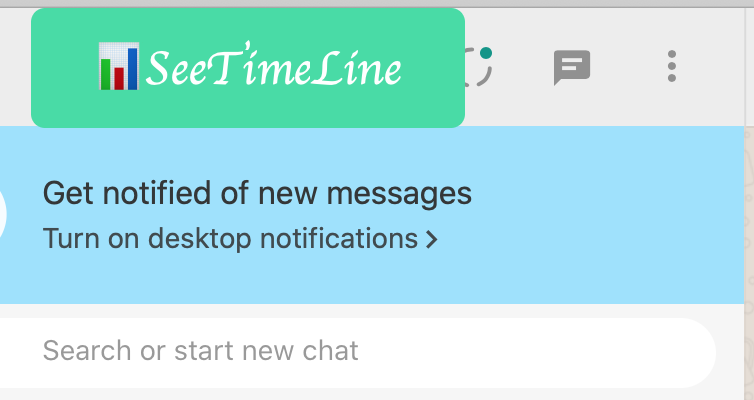

# StalkOnWhatsapp

This can be used to track online status of contacts( even if they have hidden it using privacy settings) , visualize online timeline of multiple people in a graph, and predict if two contacts were chatting together by checking overlap in their online timeline.

## Steps to follow.

- Open whatsapp web in browser
- Follow either of these steps to run the script
  - **Using BookMark** : Add new bookmark in your browser with URL as **contents** of this file [StalkWhatsapp](src/stalk_bookmarklet.js). Click on this bookmark after whatsapp web has loaded for magic to begin.
  - **Using Browser Console** : After whatsapp web has loaded, open [Developer's console in Browser](https://balsamiq.com/support/faqs/browserconsole/#:~:text=To%20open%20the%20developer%20console,(on%20Windows%2FLinux)). Paste the contents of [StalkWhatsapp](src/stalk.js) file in the console and hit enter.
- Enter the names of contact you want to stalk.(multiple names to be separated by comma, case sensitive). The contact to be stalked should be present in recent chat. Tip : Can pin the person to top if chat has gone down.) [Sample](/images/contactname.png)
- Stalking has started. Click SeeTimeLine button to check the graph and the report ( If browser console is open, you can see data of online status change coming as logs).

This also reports people who were online together for maximum time. Happy Stalking :smile: :sunglasses:!! 

Disclaimer: Use at your own discretion.

## Credits
- For any help with this feel free to reach out to me on : [LinkedIn](https://www.linkedin.com/in/suryakant-pandey/), [Instagram](https://www.instagram.com/suryakant_._pandey/)

- Detailed Explaination : [Medium](https://medium.com/@pd.skant/stalk-someone-on-whatsapp-educational-purpose-only-370c91f09eb8?sk=d5013cc89c3625bc3303bfdaefbea4ce) 

- Make sure you give this project a star if you liked this project and want to see more.
